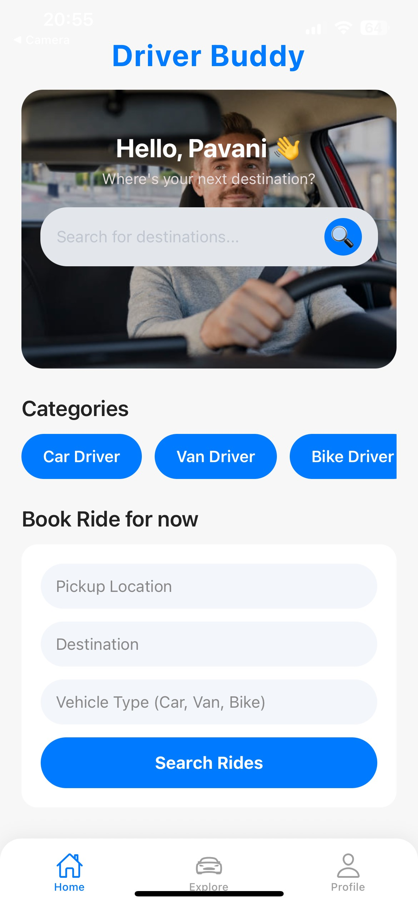
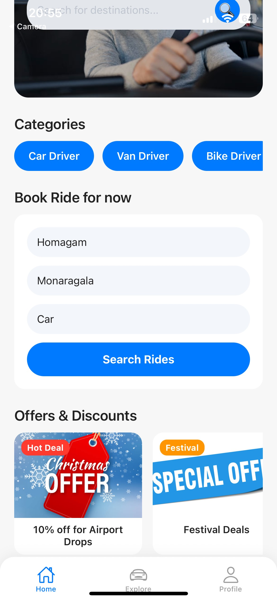
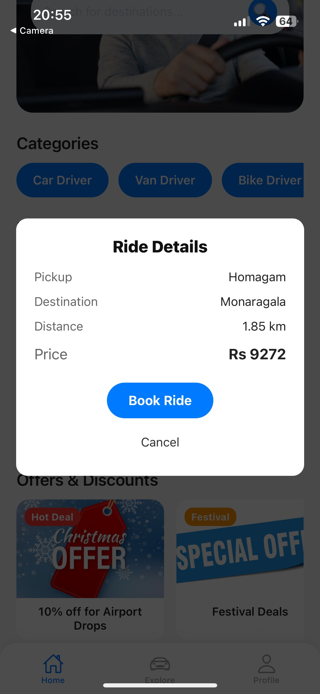
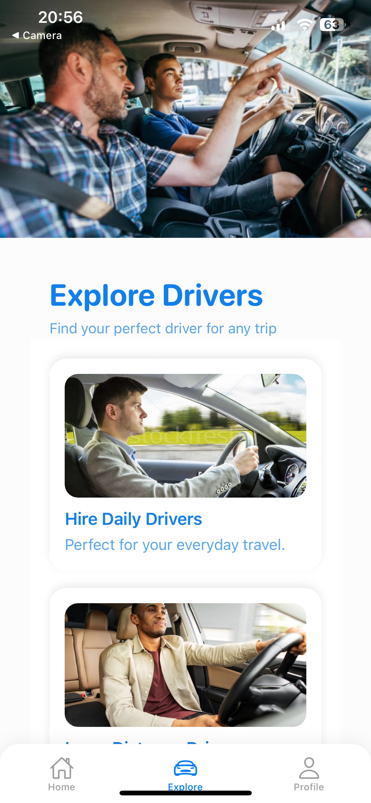
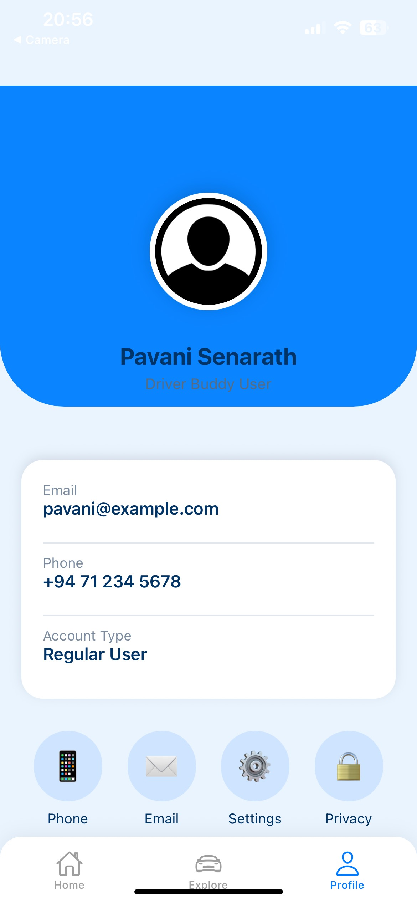

# 🚗 Driver Rent App Frontend

The **Driver Rent App** allows users to hire professional drivers for daily travel, long-distance rides, and night driving.  
The Explore Screen provides a clean and modern UI with a white theme, smooth scrolling, feature cards, driver categories, and a list of popular drivers.

---

## ✨ Features

- 🎡 **Parallax Header Image**  
- 📦 **Feature Cards** (Daily, Long-Distance, Night Driving)  
- 🚘 **Driver Categories** (Car, Van, Truck)  
- ⭐ **Popular Drivers Section** (with ratings & trips)  
- 🎨 **White + Blue Clean UI Theme**  
- 📱 **Fully Responsive Layout for Mobile**

---

## 📸 Screenshots

### **Screen Overview**

  
  
  
  
  


---

## 📦 Installation

```sh
git clone <your-repository-url>
cd driver-rent-app
npm install
tps://chat.expo.dev): Chat with Expo users and ask questions.
